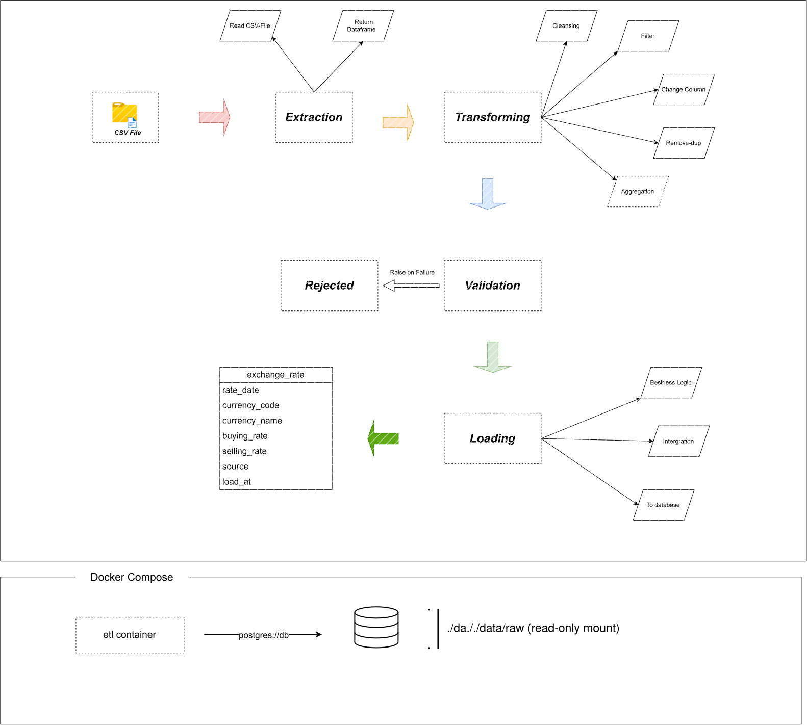

# Cambodia Exchange Rate Pipeline

An ETL pipeline that loads National Bank of Cambodia (NBC) USD/KHR
exchange rates from a raw CSV into a PostgreSQL data warehouse.

## Overview

This project loads 20+ years of USD/KHR exchange-rate data published by
the National Bank of Cambodia into a queryable PostgreSQL warehouse.

The pipeline follows a classic **extract → transform → validate → load**
pattern:

- **Extract** — reads the raw CSV and logs row count + file size.
- **Transform** — cleans the data: parses dates, coerces rates to numeric,
  enforces a DROP policy for invalid rows, deduplicates on the primary key.
- **Validate** — runs four data-quality rules (required columns, date parsing,
  positive rates, no duplicates) before anything touches the database.
- **Load** — idempotent UPSERT into `exchange_rates` via a staging table, so
  running the pipeline any number of times produces zero duplicates.

The whole pipeline runs either locally (Python venv) or fully containerized
(Docker Compose), and includes SQL-level data-quality checks and analytical
queries.

## Architecture



## Tech Stack

| Layer | Technology |
|---|---|
| Language | Python 3.11 |
| Data wrangling | pandas 3.0 |
| Database driver | SQLAlchemy 2.1 + psycopg2-binary |
| Database | PostgreSQL 18 (Docker) |
| Config | python-dotenv |
| Testing | pytest |
| Containerization | Docker + Docker Compose |

## Project Structure

```
Cambodia_exchange_rate_pipeline/
├── main.py                       Entry point — orchestrates extract → transform → validate → load
├── Dockerfile                    Builds the ETL container image
├── docker-compose.yml            Postgres + ETL services, network, volumes
├── requirements.txt              Pinned Python dependencies
├── .env / .env.example           DB credentials (real .env not in git)
├── pytest.ini                    Test config (pythonpath = .)
├── README.md / NOTES.md / HANDOFF.md
│
├── src/
│   ├── extract.py                extract_csv(path) → DataFrame
│   ├── transform.py              transform(df) → cleaned DataFrame (DROP policy)
│   ├── validate.py               4 quality checks + validate(df) entry point
│   └── load.py                   make_engine() + load() (UPSERT via staging)
│
├── sql/
│   ├── 01_create_schema.sql      Creates exchange_rates table (runs on db init)
│   ├── 02_quality_checks.sql     6 data-quality checks (scoreboard output)
│   └── 03_analysis_queries.sql   4 analytical queries
│
├── test/
│   ├── test_extract.py
│   ├── test_transform.py
│   ├── test_validate.py
│   └── test_load.py
│
├── data/
│   ├── raw/                      Input CSV (mounted read-only into etl container)
│   └── processed/                Output CSV (gitignored)
│
└── docs/
    └── diagrams/
        ├── pipeline.drawio       Source (editable in draw.io)
        └── pipeline.svg          Export for README
```

## Data Source & Schema

### Source

- **Provider:** National Bank of Cambodia (NBC)
- **File:** `data/raw/KhmerRiel-USDExchangeRate2003-2023.csv`
- **Contents:** 7531 rows, dated 2003-04-01 to 2023-12-31
- **Columns used:** `date`, `purchase`, `sale` (other columns ignored)

### Target table: `exchange_rates`

| Column | Type | Notes |
|---|---|---|
| `rate_date` | `DATE NOT NULL` | Part of primary key |
| `currency_code` | `VARCHAR(3) NOT NULL` | Part of primary key (e.g. `USD`) |
| `currency_name` | `VARCHAR(64) NOT NULL` | e.g. `US Dollar` |
| `buying_rate` | `NUMERIC(18,6)` | NBC "purchase" rate |
| `selling_rate` | `NUMERIC(18,6)` | NBC "sale" rate |
| `source` | `VARCHAR(32) NOT NULL` | Data source tag (e.g. `NBC`) |
| `loaded_at` | `TIMESTAMPTZ NOT NULL DEFAULT NOW()` | Auto-set on insert/update |

**Primary key:** `(rate_date, currency_code)` — one row per currency per day.

The table is created by `sql/01_create_schema.sql`, which Postgres runs
automatically the first time the Docker container initializes.

## How to Run

### Option A — Docker Compose (recommended)

One command builds the ETL image, starts Postgres, waits for it to be
healthy, and runs the pipeline:

```bash
docker compose up --build
```

The `etl` container runs once and exits (batch job); `db` stays running.

Inspect the results:

```bash
docker compose exec db psql -U exchange_user -d exchange_db
```

Run the quality checks and analysis queries:

```bash
docker compose exec db psql -U exchange_user -d exchange_db -P pager=off \
    -f /sql/02_quality_checks.sql

docker compose exec db psql -U exchange_user -d exchange_db -P pager=off \
    -f /sql/03_analysis_queries.sql
```

Tear everything down (removes data):

```bash
docker compose down -v
```

### Option B — Local Python

```bash
python -m venv venv
venv\Scripts\Activate.ps1            # Windows
# source venv/bin/activate           # macOS/Linux

pip install -r requirements.txt
docker compose up -d db              # Postgres only

python main.py                       # run the pipeline
pytest test/ -v                      # run the tests
```

### Environment variables

Copy `.env.example` to `.env` and set:

```
POSTGRES_USER=exchange_user
POSTGRES_PASSWORD=exchange_password
POSTGRES_DB=exchange_db
POSTGRES_HOST=localhost
POSTGRES_PORT=5432
```

When running via Docker Compose, `POSTGRES_HOST` is overridden to `db`
by the `etl` service definition.

## Data Quality Checks

Beyond the Python-level validation inside the pipeline, six SQL checks
run **against the loaded warehouse** to catch problems that slip through
or appear after loading.

All checks live in `sql/02_quality_checks.sql`. Each returns exactly one
row — `check_name | status | failed_rows | details` — so the whole file
outputs a clean scoreboard.

| # | Check | What it verifies |
|---|---|---|
| 1 | **uniqueness** | No duplicate `(rate_date, currency_code)` pairs |
| 2 | **completeness** | No NULLs in required columns |
| 3 | **validity** | Positive rates, plausible dates, known currency codes |
| 4 | **freshness** | Last `loaded_at` is within 24 hours |
| 5 | **volume** | Row count is within the expected range (7000–8000) |
| 6 | **business_logic** | Buying ≤ selling + 100 KHR, both rates in 3000–5000 band |

### The 100 KHR tolerance

The business-logic check originally flagged 16 rows where `buying_rate`
exceeded `selling_rate`. Investigation showed:

- All 16 came from the raw CSV (not a transform bug)
- The reversal was tiny — 1 to 91 KHR
- Spread across 2004–2014, not clustered

This is normal noise for a **pegged currency** on quiet days. The rule
was loosened to `buying_rate > selling_rate + 100`, which now flags only
genuine anomalies (swapped columns, data-entry errors).

### Running the checks

```bash
docker compose exec db psql -U exchange_user -d exchange_db -P pager=off \
    -f /sql/02_quality_checks.sql
```

A healthy warehouse shows `status = PASS` on all six rows.

## Testing

Tests are organized one file per module in `src/`:

| File | Covers |
|---|---|
| `test/test_extract.py` | `extract_csv()` reads the CSV, raises on missing file |
| `test/test_transform.py` | Clean schema output, date drop policy |
| `test/test_validate.py` | All four checks — pass and fail paths |
| `test/test_load.py` | Empty DataFrame short-circuit, engine URL from env vars |

Run the suite:

```bash
pytest test/ -v
```

Expected output:

```
16 passed in 0.5s
```

### What's covered vs. not

- **Covered:** logic inside `extract`, `transform`, `validate`, and the
  non-DB parts of `load`.
- **Not yet covered:** integration tests that actually hit Postgres (the
  UPSERT path). This is on the roadmap — see Future Work.

The idempotency property (running the pipeline twice produces zero
duplicates) was verified manually in Day 7 via SQL duplicate checks.

## Future Work

Ideas for extending the pipeline, in rough priority order:

- **Integration tests for `load()`** — spin up a throwaway table, run the
  UPSERT twice, assert no duplicates. Automates the Day 7 manual check.
- **GitHub Actions CI** — run `pytest test/ -v` on every push. Catch
  regressions before they reach `main`.
- **Rejected-row audit trail** — instead of silently dropping invalid rows,
  write them to `data/processed/rejected.csv` so failures can be reviewed.
- **CLI flags** — `python main.py --csv path --dry-run` so the pipeline
  can be reused for other files or tested without touching the DB.
- **Multiple currencies** — the schema already supports it via
  `currency_code` in the primary key; the transform currently hardcodes USD.
- **Scheduling** — run the pipeline daily via cron or a scheduler
  (Airflow, Dagster, or just a scheduled Docker Compose job).
- **Incremental loads** — the UPSERT supports it, but the extract still
  reads the full CSV every time. Real incremental loads would scan a
  date range instead.